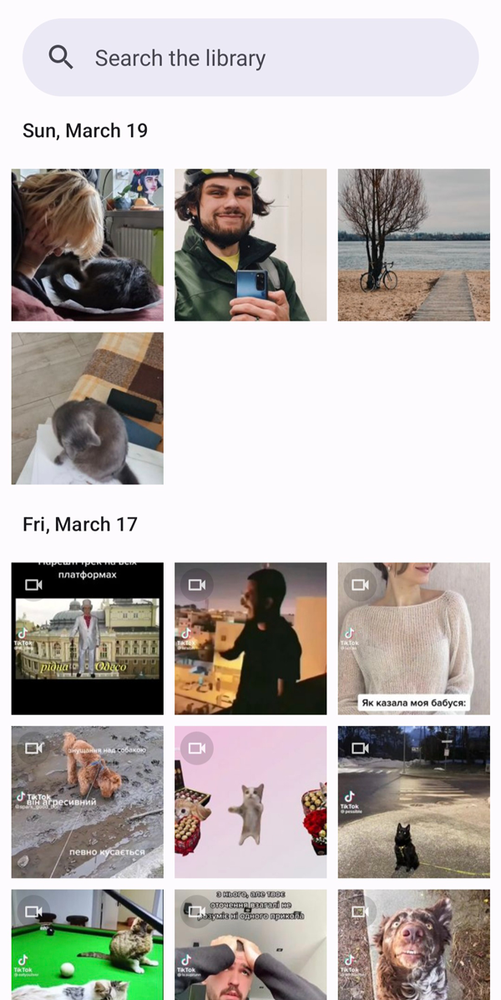
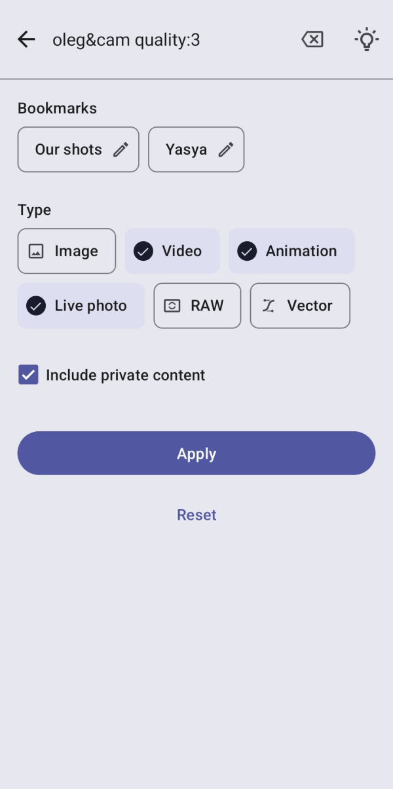
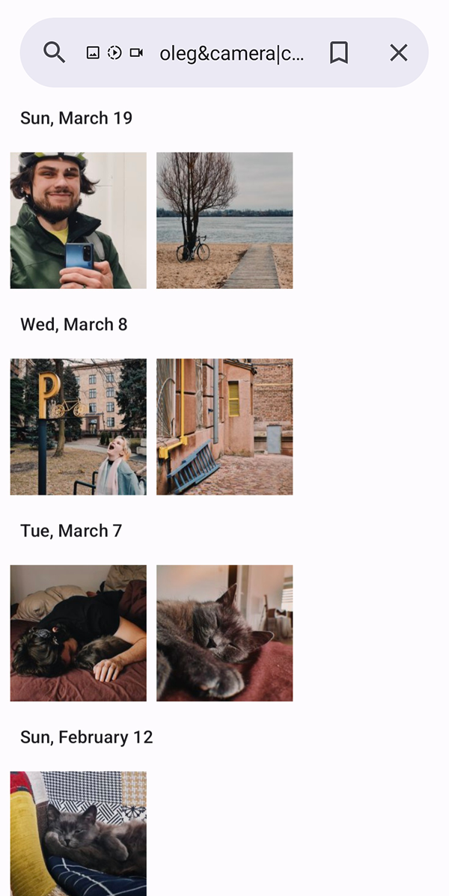
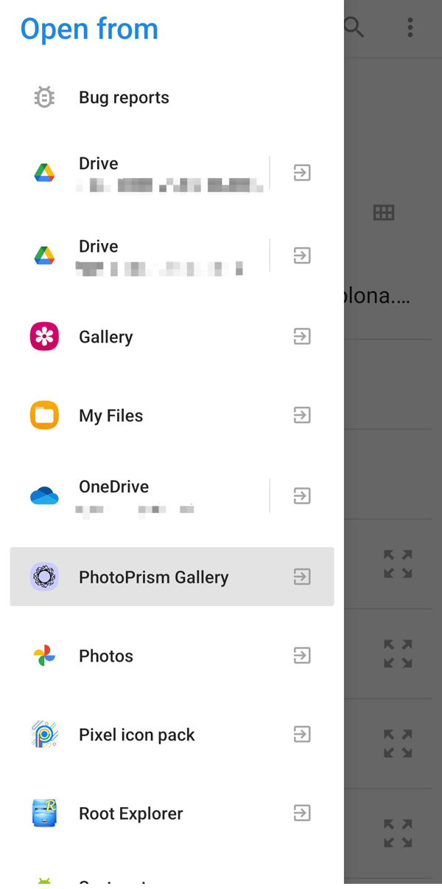

#  Gallery for PhotoPrism

 
 
 

This Android app brings a convenient mobile gallery experience for [PhotoPrism](https://www.photoprism.app/).

It does not support all the official web app functionality, but nevertheless has plenty of useful features:
- Sending photos and videos to Gmail, Telegram or any other app
- Content timeline with 5 grid size options, grouped by days and months
- Timeline scroll that lets you quickly jump to a specific month
- [Configurable search](https://github.com/Radiokot/photoprism-android-client/wiki/How-to-search-the-library)
- [Search bookmarks](https://github.com/Radiokot/photoprism-android-client/wiki/How-to-use-search-bookmarks) that let you save search configurations and apply them later
- Enhanced live photo viewer, which works best with Samsung and Apple shots
- Full-screen slideshow with 5 speed options
- Deleting items without archiving them first
- Importing photos and videos trough sharing
- [Connection to both private and public libraries](https://github.com/Radiokot/photoprism-android-client/wiki/Connection-guide)
- Endless session without the need to re-enter the password
- Support for [mTLS (mutual TLS)](https://github.com/Radiokot/photoprism-android-client/wiki/How-to-connect-to-a-library-with-mTLS-(mutual-TLS)-auth%3F), [HTTP basic auth](https://github.com/Radiokot/photoprism-android-client/wiki/Connection-guide#examples-of-valid-urls) and [SSO](https://github.com/Radiokot/photoprism-android-client/wiki/Connection-guide#sso) like Authelia, Cloudflare Access, etc.
- Basic TV compatibility that lets you browse and search the timeline with a remote-control
  (Not available in Google Play on TV, [install as APK](https://github.com/Radiokot/photoprism-android-client/issues/66#issuecomment-1667426238))
- ⭐ Extensions:
  - [Memories](https://github.com/Radiokot/photoprism-android-client/wiki/Memories-extension) – get a daily collection of photos and videos from the same day in past years
  - [Photo frame widget](https://github.com/Radiokot/photoprism-android-client/wiki/Photo-frame-widget-extension) – see random photos from your library on the home screen

The gallery is not intended to sync content with the library. 
For this, I recommend [Autosync](https://play.google.com/store/apps/details?id=com.ttxapps.autosync).

## Compatibility
The gallery runs on Android 5.0+ and it is confirmed to work with the PhotoPrism release of 
[November 30, 2025](https://github.com/photoprism/photoprism/releases/tag/251130-b3068414c).
Compatibility with older PhotoPrism versions may be partial.

## Download
[ APK from the latest release](https://github.com/Radiokot/photoprism-android-client/releases/latest)

[ Obtainium](https://apps.obtainium.imranr.dev/redirect?r=obtainium://app/%7B%22id%22%3A%22ua.com.radiokot.photoprism%22%2C%22url%22%3A%22https%3A%2F%2Fgithub.com%2FRadiokot%2Fphotoprism-android-client%22%2C%22author%22%3A%22Radiokot%22%2C%22name%22%3A%22PhotoPrism%20Gallery%22%2C%22preferredApkIndex%22%3A0%2C%22additionalSettings%22%3A%22%7B%5C%22includePrereleases%5C%22%3Afalse%2C%5C%22fallbackToOlderReleases%5C%22%3Atrue%2C%5C%22filterReleaseTitlesByRegEx%5C%22%3A%5C%22%5C%22%2C%5C%22filterReleaseNotesByRegEx%5C%22%3A%5C%22%5C%22%2C%5C%22verifyLatestTag%5C%22%3Afalse%2C%5C%22dontSortReleasesList%5C%22%3Afalse%2C%5C%22useLatestAssetDateAsReleaseDate%5C%22%3Afalse%2C%5C%22releaseTitleAsVersion%5C%22%3Afalse%2C%5C%22trackOnly%5C%22%3Afalse%2C%5C%22versionExtractionRegEx%5C%22%3A%5C%22%5C%22%2C%5C%22matchGroupToUse%5C%22%3A%5C%22%5C%22%2C%5C%22versionDetection%5C%22%3Atrue%2C%5C%22releaseDateAsVersion%5C%22%3Afalse%2C%5C%22useVersionCodeAsOSVersion%5C%22%3Afalse%2C%5C%22apkFilterRegEx%5C%22%3A%5C%22%5C%22%2C%5C%22invertAPKFilter%5C%22%3Afalse%2C%5C%22autoApkFilterByArch%5C%22%3Afalse%2C%5C%22appName%5C%22%3A%5C%22Gallery%20for%20PhotoPrism%5C%22%2C%5C%22shizukuPretendToBeGooglePlay%5C%22%3Afalse%2C%5C%22allowInsecure%5C%22%3Afalse%2C%5C%22exemptFromBackgroundUpdates%5C%22%3Afalse%2C%5C%22skipUpdateNotifications%5C%22%3Afalse%2C%5C%22about%5C%22%3A%5C%22A%20convenient%20gallery%20for%20PhotoPrism%20library%20with%20plenty%20of%20useful%20features%5C%22%2C%5C%22refreshBeforeDownload%5C%22%3Atrue%7D%22%2C%22overrideSource%22%3A%22GitHub%22%7D)

[ F-Droid](https://f-droid.org/packages/ua.com.radiokot.photoprism)

[ Google Play](https://play.google.com/store/apps/details?id=ua.com.radiokot.photoprism) (has no [extension catalog](https://github.com/Radiokot/photoprism-android-client/wiki/Gallery-extensions))

## Sponsors

 
…and 19 anonymous sponsors.

*I am very grateful to everyone [supporting this project](https://radiokot.com.ua/tip) ❤️ To join this public list, email me the transaction reference once it is complete. By the way, sponsors get [extensions](https://github.com/Radiokot/photoprism-android-client/wiki/Gallery-extensions) for free.*

## License
I reject the concept of intellectual property. Claiming ownership over information that can be replicated perfectly and endlessly is inherently flawed. Consequently, any efforts to uphold such form of ownership inevitably result in some people gaining unjustifiable control over other's tangible resources, such as computers, printing equipment, construction materials, etc. [1](repository-assets/kinsella_against_intellectual_property.pdf)
When talking specifically about source code licensing – without a state violently enforcing [copyright monopolies](https://torrentfreak.com/language-matters-framing-the-copyright-monopoly-so-we-can-keep-our-liberties-130714/), it would be ludicrous to assume that a mere text file in a directory enables someone to restrict processing copies of this information by others on their very own computers. 
However, there is [such a file](LICENSE) in this repository bearing the GPLv3 license. Why?

One would expect someone with such an attitude to not use the license at all, use a permissive license, or [explicitly unlicense](https://unlicense.org/).
But for me, to do so is to voluntarily limit my means of defense. To act as a gentleman with those who readily exploit state violence against you is to lose.
In a world where copyright monopolies are violently enforced, I choose GPLv3 for the software I really care for, because under the current circumstances this license is a tool that:
- Allows **others** to freely use, modify and distribute this software, without the risk of being sued;
- Enables **me** to pull all the valuable changes from public forks back to the trunk, also without the risk of being sued;
- **Knocks down a peg** individuals or companies willing to monopolize their use case or modifications of this software.

## Tech stack
- Kotlin
- Classic views & ViewModel
- RxJava for concurrency
- Koin for dependency injection
- OkHTTP & Retrofit for networking
- Room database
- kotlin-logging & slf4j-handroid for logging
- Picasso for images & ExoPlayer for videos
- FastAdapter for lists
- Offline License Key for extensions activation
- MapLibre for maps
